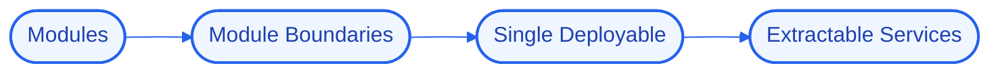

# MonoScale
### A modular monolith that scales like services but ships like one app.


## 📖 Overview
MonoScale is a NestJS modular monolith with strict module boundaries, so features stay decoupled and any module can be extracted into its own service later without a rewrite.

> Part of my Senior Hybrid Engineer 2026 portfolio (`#38`). Built on the "Antigravity" model — logic, state, and UI run locally in Docker while heavy reasoning is offloaded to cloud APIs, so the whole system runs on modest hardware.

## 🚀 Quick Start
```bash
# 1. Clone
git clone https://github.com/Kimosabey/mono-scale.git
cd mono-scale

# 2. Install
# (see docs/GETTING_STARTED.md for the full setup)

# 3. Run
docker compose up
```

## ✨ Key Features
- Strict module boundaries inside one deployable
- Clear seams for future service extraction
- Shared infra, isolated domains
- Faster iteration than premature microservices

## 🏗️ Architecture


Enforcing boundaries in a monolith so it keeps the option of splitting without the cost of distributing early.

See [docs/ARCHITECTURE.md](./docs/ARCHITECTURE.md) for the full HLD/LLD and design decisions.

## 🧰 Tech Stack
| Layer | Technology | Role |
| :--- | :--- | :--- |
| NestJS | `NestJS` | Structured TypeScript backend |
| TypeScript | `TypeScript` | Type-safe application code |

## 📚 Documentation
- [Architecture](./docs/ARCHITECTURE.md) — high- and low-level design, decision log
- [Getting Started](./docs/GETTING_STARTED.md) — prerequisites, setup, environment
- [Failure Scenarios](./docs/FAILURE_SCENARIOS.md) — fault analysis and recovery
- [Interview Q&A](./docs/INTERVIEW_QA.md) — deep-dive walkthrough

## 🔭 Future Enhancements
- Module dependency linter
- Per-module metrics
- Extraction playbook

## 📄 License
Released under the MIT License.

## 👤 Author

**Harshan Aiyappa**
Senior Full-Stack Hybrid AI Engineer
Voice AI • Distributed Systems • Infrastructure

[](https://kimo-nexus.vercel.app/)
[](https://github.com/Kimosabey)
[](https://linkedin.com/in/harshan-aiyappa)
[](https://x.com/HarshanAiyappa)
