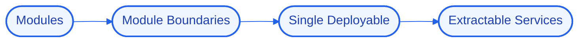

# Architecture — MonoScale

## High-Level Design (HLD)
MonoScale is a NestJS modular monolith with strict module boundaries, so features stay decoupled and any module can be extracted into its own service later without a rewrite.

**Flow:** Modules → Module Boundaries → Single Deployable → Extractable Services

## Low-Level Design (LLD)
- **Components:** `NestJS`, `TypeScript`
- **Interfaces / contracts:** to be finalized during implementation.
- **Data model:** to be defined per component.

## Decision Log
- **Why this stack:** **NestJS** — structured typescript backend; **TypeScript** — type-safe application code.
- **Antigravity constraint:** run logic/state/UI locally; offload heavy reasoning to cloud APIs; target modest hardware.

## Concept Deep Dive
Enforcing boundaries in a monolith so it keeps the option of splitting without the cost of distributing early.
